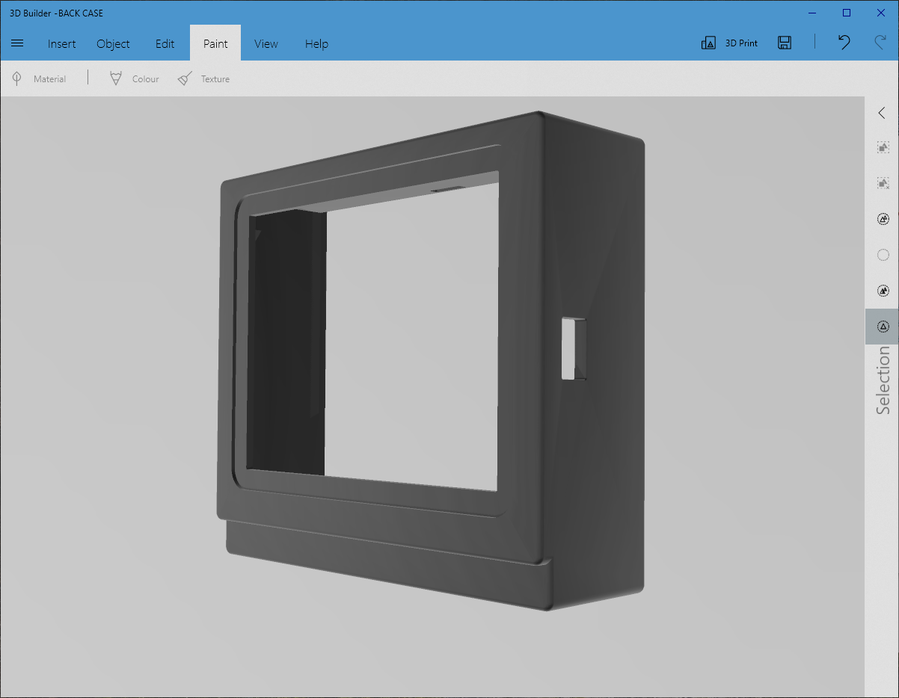
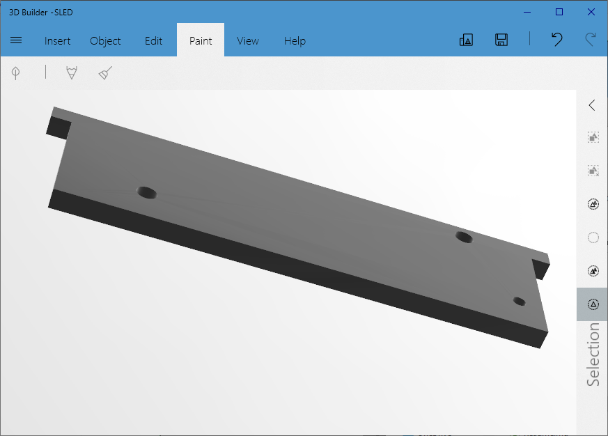
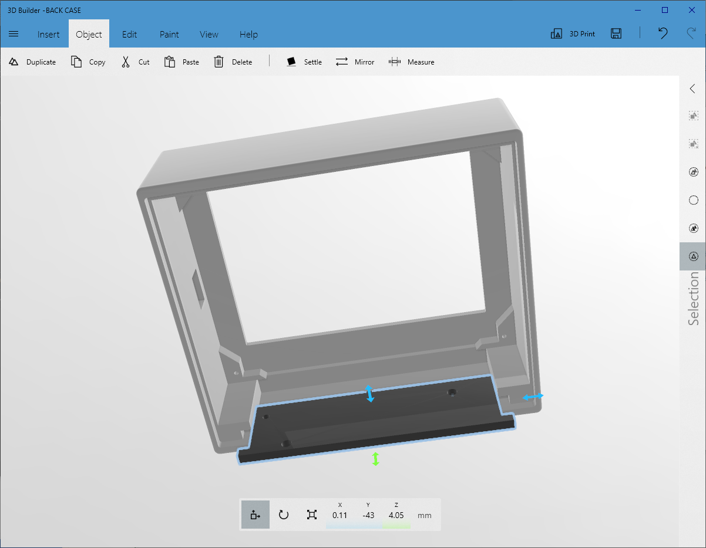

This case design was based on my prototype case design pictured in the Readme.md in the root of this project.

The design work on this iteration of the case was done by Shiv Kumar on Fiverr (https://www.fiverr.com/kumarshiv29). Shiv offered me unlimited revisions and further help after the fiverr gig had been completed, so many thanks to him.

# Battery Sled
The present version of the case includes a sled to mount the battery holder and fix it securely within the case. The sled slides in at the bottom of the case, from the back, and is designed to accept a Keystone 1044 panel mounting 18650 battery holder with solder tabs (Mouser: https://www.mouser.co.uk/ProductDetail/Keystone-Electronics/1044?qs=up89fPMRNqDbJ6cCmjKOVA%3D%3D).

