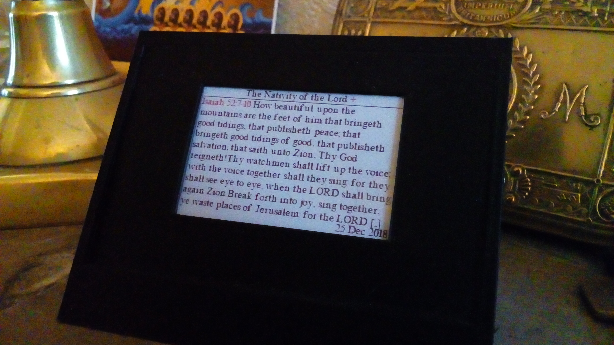
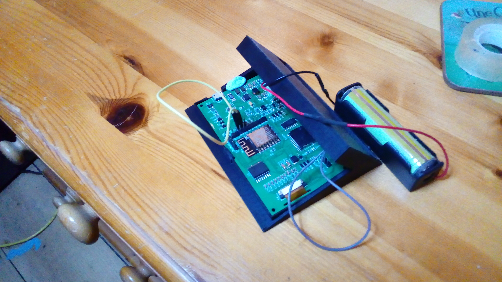
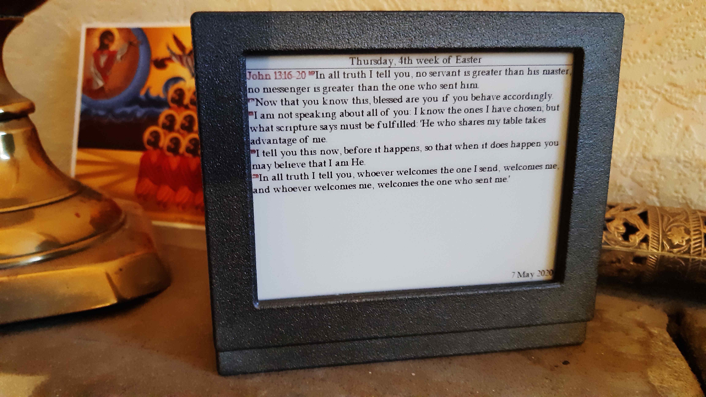
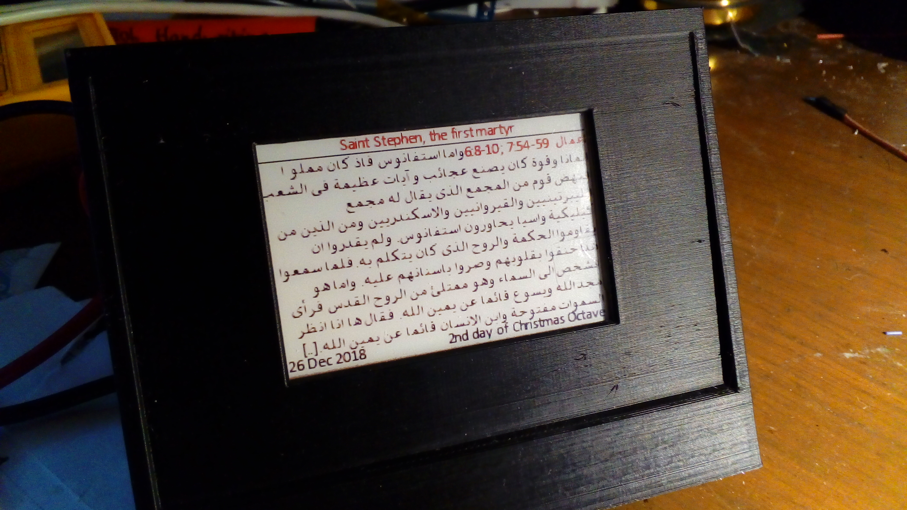
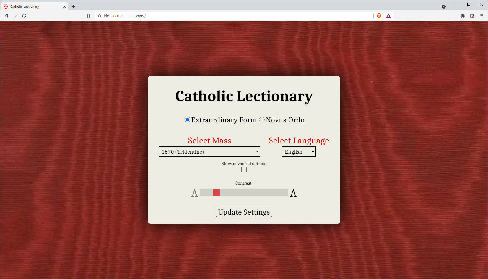
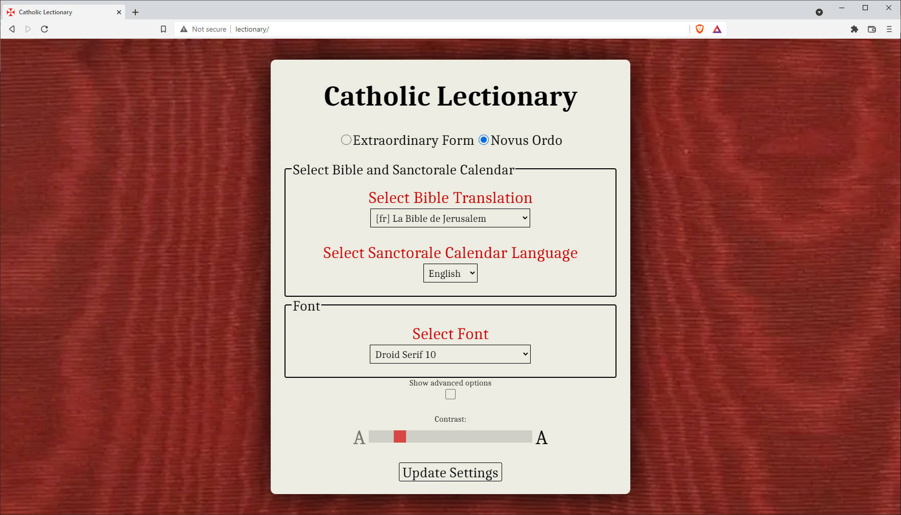

# Catholic-Lectionary-on-ESP8266
The Roman Catholic Lectionary, Liturgical Calendar and Feast Days on ESP8266 with Dalian/Waveshare 2.7" or 4.2" red/black SPI display, SPI-mode SD card, DS3231 clock IC and Nanjing Top Power TP5410 PMIC/boost IC, with support for 8 grey/red levels + antialiased text

<h2>Catholic Lectionary</h2>

This project implements a Calendar, Liturgical calendar, Lectionary and Feast Day (Sanctorale) calendar on the ESP8266. It also shows an indicator for Holy Days of Obligation.
It is based on the Ruby program calendarium-romanum (https://github.com/igneus/calendarium-romanum) which implements just the Liturgical calendar and Sanctorale days. As a result, it uses the some of the same configuration files and file formats as this program, with some modifications to support month names etc.

<h2>Latin Mass</h2>

The Latin Mass Propers (shown above) are now available in several languages and versions, based on output captured from a modified version of the Divinum Officium project (https://github.com/DivinumOfficium/divinum-officium). As programmed, Latin Mass Propers update twelve times daily. The Introitus for the day's Mass is shown from Midnight to 9am, then the Gloria, Collect, Lesson, Gradual, Gospel, Credo, Offertorium, Secreta, Prefatio, Communio are shown at hourly intervals thereafter, until 7pm, when the Postcommunio is shown (until midnight). On Good Friday and Holy Saturday a slightly different pattern occurs, due to the Propers for these days having more parts.

Images for seasonal days, feasts and votive masses are included in the SD card file tree. If an image or images are available for a given day, they will be displayed between midnight and 8am and between 8pm and midnight, with all of the text readings displayed at hourly intervals during the day in between as above. 

On Good Friday an image will also be displayed at 3pm for one hour, followed by the readings for the Adoration of the Cross and Communion up to 8pm, when the image shown at 3pm will be displayed again until midnight.

<h3>Localization</h3>

The project is localized for English, French, Czech and Latin, and other languages, Bible translations, Sanctorale days and Liturgical days can be added over time as all configuration data resides on the SD card.
Arabic ligaturization is supported, and in the SD card archive an Arabic Bible is available (which I was using to test Arabic ligaturization). However, the Sanctorale and Liturgical days are still shown in English with this Bible (but this can be modified if anyone would like to translate the underlying files into Arabic).

<h3>Web Configuration Page</h3>

The web configuration interface has been rewritten and styled:

<h3>Embedded FTP Server</h3>

The Lectionary has an embedded FTP server which enables wireless access to the SD card database of readings. This allows updates to the SD card without removing it from the unit. The FTP server code was adapted to support SD card access on ESP8266 from Renzo Mischianti's SimpleFTPServer (https://www.mischianti.org/2020/02/08/ftp-server-on-esp8266-and-esp32/ / GitHub https://github.com/xreef/SimpleFTPServer (previously it supported only SPIFFS on ESP8266).

<h4>FTP Server Notes</h4>
<ul>
  <li>The FTP Server only runs when the USB power is plugged in, along with the Web Server and Flash OTA update service. It will continue to wait for a connection for up to ten minutes before returning to the Mass reading.</li>
  <li>If there are active transfers going on when the usual 10 minute timeout period expires, the FTP Server will delay the Mass reading and continue to run until the client disconnects.</li>  
  <li>The username and password for the FTP server is <code>Lectionary</code>.</li>
  <li>The FTP Server has a short login timeout, so it is best used with automated FTP clients (such as FileZilla) which pre-store the login credentials and transmit them to the server immediately upon connection.</li>
  <li>The FTP Server supports only one connection at a time, so this needs to be configured in the client.</li>
  <li>The transfer speed to and from the SD card is typically about 90 - 100 kB/sec (speed limited by SPI access to the SD card).</li>
</ul>

<h3>ToolChain</h3>

Several Toolchain projects are provided, written in C# and C++, one of which - TheDotFactory (https://github.com/pavius/the-dot-factory/tree/master/TheDotFactory) - is not mine, but I have modified it to output "disk fonts", which are bitmap fonts which can be used as an alternative to the built-in rom font used by default. (They may be useful for other character sets needing more detail and larger characters, such as Chinese or Arabic).

<h3>SD Card Image for use with Lectionary</h3>

The Lectionary's most current SD card file tree (in .zip format) can be found at https://drive.google.com/file/d/1ES8D33cdnYufH8ShwEzjmbXzUL9DopEA/view?usp=sharing (Github lfs large file support is over quota and has been disabled, so the file will be hosted on a Google drive account for now).

The SD card file tree image contains all of the Liturgical readings, Bibles texts and pictures needed for the Lectionary to work. Extract these files to an SD card of max 32Gb in size.

<h3>Debug Output</h3>
<h4>Output to file DEBUGLOG.TXT on SD card</h4>

The backchannel debug output can also be captured unattended to the SD card, so that if a crashdump occurs it will be recoverable from the SD card for later debugging. To enable this, connect USB power to the Lectionary and wait until the Lectionary connects to the configured wireless network (press the WPS button on the router when prompted if no wireless network is configured). On a web browser on a computer on the same network, navigate to lectionary.local or the IP address displayed on the Lectionary's screen, appending setconf.htm?debug=2 to enable debug output to the SD card.

<h4>Output via I2C to serial backchannel</h4>

In order to maximize available pins on the ESP8266, the TX and RX pins are used as an I2C bus to control the DS3231 clock chip. So, to retain the ability to output backchannel debug text therefore an additional program is provided which can be compiled and uploaded to a separate 3.3v Arduino Leonardo, which can then be attached to the ESP8266 by connecting TX (on the Lectionary's ESP8266) to SDA (on the Leonardo) and RX to SCL. Debug output can then be enabled using ?debug=1 as one of the parameters to the setconf webpage served by the lectionary, eg. http://lectionary.local/setconf.htm?debug=1. (Use the IP address displayed on the Lectionary's screen if the mDNS "lectionary.local" url does not work with your browser).

<h4>To enable both I2C Serial and SD card debug output</h4>

To enable both I2C Serial and SD card debug output, repeat the step above, but with ?debug=3</o>
<h4>To disable all debugging</h4>

To disable all debug output, repeat the above step with ?debug=0

<h3>OTA Updates using Wifi and the Arduino IDE</h3>

Support has been added for over-the-air flash updates to the Lectionary's ESP8266 using the feature in the Arduino development environment.

Note that for this to work the project must be built with 1M (not 3M) of SPIFFS, to allow space in the flash memory for the update (which is nearing 1M in size now).

<h3>Build Settings</h3>

The Build settings for the project using the Arduino development environment are as follows:

<ul>
<li>Build with NodeMCU1.0(ESP12E module) config (Tools->Board)</li>
<li>CPU Freq 80MHz</li>
<li>Debug Port: Disabled/Debug Level: None</li>
<li>Flash Size 4M (1M SPIFFS) (1M spiffs allows space for OTA update)</li>
<li>IWIP Variant: v1.4 Prebuilt</li>
</ul>

These settings have been tested and found to be working. Others are not guaranteed or likely to work without changes to the code.

<h3>Hardware</h3>
The current printed circuit board schematic and design can be found at https://easyeda.com/plishman/lectionary_2-3

The current case design is at https://www.tinkercad.com/things/h8xbfqkVT7G

As well as the other Arduino libraries, this project uses the following libraries:
<ul>
  <li>GxEPD - https://github.com/ZinggJM/GxEPD (modified for 3bpp - 7 grey/red levels, plus white)</li>
  <li>Adafruit GFX - https://travis-ci.org/adafruit/Adafruit-GFX-Library</li>
  <li>brzo_i2c - https://github.com/pasko-zh/brzo_i2c</li>
  <li>LinkedList - https://github.com/ivanseidel/LinkedList</li>
</ul>

Modified versions of the Time and SPI arduino libraries are also used: The time library has been changed to use a 64-bit value to store the time in seconds since 1970 so that the 2038 bug will not occur. The SPI library has had an extra function added which permits 9-bit SPI data to be written, so that the WaveShare/Dalian display used can be operated on 3 wires instead of 4 (no need for a data/command wire, the d/c value is stored in the 9th bit of each byte transmitted to the screen, which saves a pin on the ESP8266).

Many thanks to the contributors of Calendarium-Romanum, TheDotFactory and all of the other libraries on which this project depends.

There is a lot to this project, and it has taken me over four years to develop the software and a board to run it on, so bear with me - I will update the readme as I go.

[This readme is still in the process of being updated]
